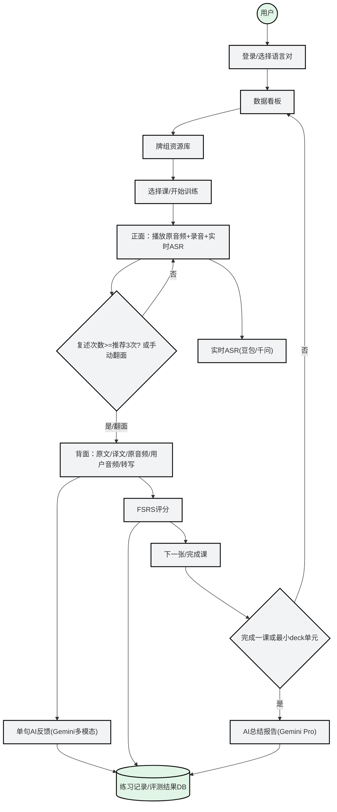

> Archived at: 2026-02-06
> Superseded by: PRD_MVP.md, frontend/PRD_MVP_FRONTEND.md, backend/PRD_MVP_BACKEND.md

# PRD 文档（复述训练 Web 版）

1. 需求背景
- 口语痛点：目标用户希望提升口语复述的流畅性与准确性，但缺乏稳定训练闭环。
- 复述闭环：需要“听-复述-反馈-复盘-复习”一体化流程与可追溯记录。
- 复习效率：引入 FSRS 与 AI 评测，帮助更高效的间隔复习与能力归因。

2. 需求概述
本产品为 Web 端“复述卡片训练”应用。用户登录并选择语言对后，从内置牌组进入训练：正面盲听+复述（实时 ASR 文本流反馈），背面展示原文/译文/对比与评分。系统基于 FSRS 进行全局调度，并通过 AI 进行单句反馈与课级总结，形成复述训练闭环。训练过程为卡片式交互，支持多次练习与复盘。

3. 优先级划分
- P0：登录/语言对选择（开发阶段可临时跳过）、内置牌组学习、卡片正反面训练、实时 ASR 文本流、翻面即答案、FSRS 评分与调度、单句 AI 反馈持久化、课级总结生成、核心看板数据。
- P1：词典/AI 解释、收藏入口、音频存储与回放体验优化、对比播放与笔记完善。
- P2：自定义牌组导入（音频切分+校对）、积分机制、社区打卡。

4. 需求详情
4.1 交互逻辑/AI需求
这部分建议配合流程图与原型图：看板/资源库/训练正面/训练背面/总结报告。

4.2 功能详情

| 模块 | 功能 | 具体内容 |
|---|---|---|
| 登录/语言对 | 账号与语言选择 | 支持英-中、法-中等语言对；开发阶段可临时跳过登录；正式版需账号体系。 |
| 数据看板 | 学习概览 | 正在学习的牌组、今日新学/复习任务（用户可自定义数量）、连续练习日历、收藏卡片入口（点击即练习）。 |
| 牌组资源库 | 内置牌组 | 结构为“册 -> 单元 -> 课”；内置牌组含新概念英语2、剑桥雅思听力，可扩展法语/日语等教材；句子预切分并含笔记字段与内置解析。 |
| 导入自定义牌组 | 音频切分 | 上传音频，选择难度/时长/AI 模型，自动切分+手工核准；支持句子/段落卡；优先级较低。 |
| 全局划词解释 | 词典+AI | 全局可划词解释；支持内置词典与导入词典；AI 解释作为补充。 |
| 训练-正面 | 理解与练习 | 原音频可多次播放；复述次数不限，推荐 3 次；实时 ASR 文本流显示（不判正误）；翻面即显示答案，不做额外延迟限定。 |
| 训练-背面 | 复盘与熟悉 | 同屏显示原文音频、原文文本、用户练习音频、转写；名词短语高亮、动词下划线；支持笔记与自评难度。 |
| AI 单句反馈 | 复述质量 | 翻面时异步上传“原音频+用户音频(+转写)”；Gemini 多模态给出建议；结果持久化。 |
| AI 课级总结 | 模式归纳 | 完成一课或最小 deck 单元后提示总结；基于单句反馈聚合输出问题模式与建议；结果持久化。 |
| FSRS 调度 | 记忆节奏 | 接入 Anki FSRS（参考 `py-fsrs`），并预留与 AI 记忆算法融合扩展。 |
| 积分/打卡 | 习惯养成 | 积分机制与社区打卡（参考 Clozemaster），后续迭代。 |

4.3 埋点需求（如有）
- DAU、连续练习天数、今日任务完成率。
- 单卡完成率、复述次数分布、翻面率。
- ASR 成功率与延迟、单句反馈生成时延与失败率。
- 课级总结触发率与完成率。
- FSRS 各评分占比与复习完成率。

5. 关键验收点
- 用户可从内置牌组进入训练并完成“正面录音-翻面-评分-下一张”闭环。
- 正面复述次数不限且推荐提示生效；翻面即显示答案。
- 实时 ASR 稳定输出文本流，不做正误判断且不阻断学习。
- 背面完整展示原文/译文/用户音频/转写，并支持高亮标注与笔记。
- 单句 AI 反馈与课级总结生成并持久化，记录可追溯。
- FSRS 调度与 `py-fsrs` 行为一致；学习进度与评测结果写入统一数据库。
